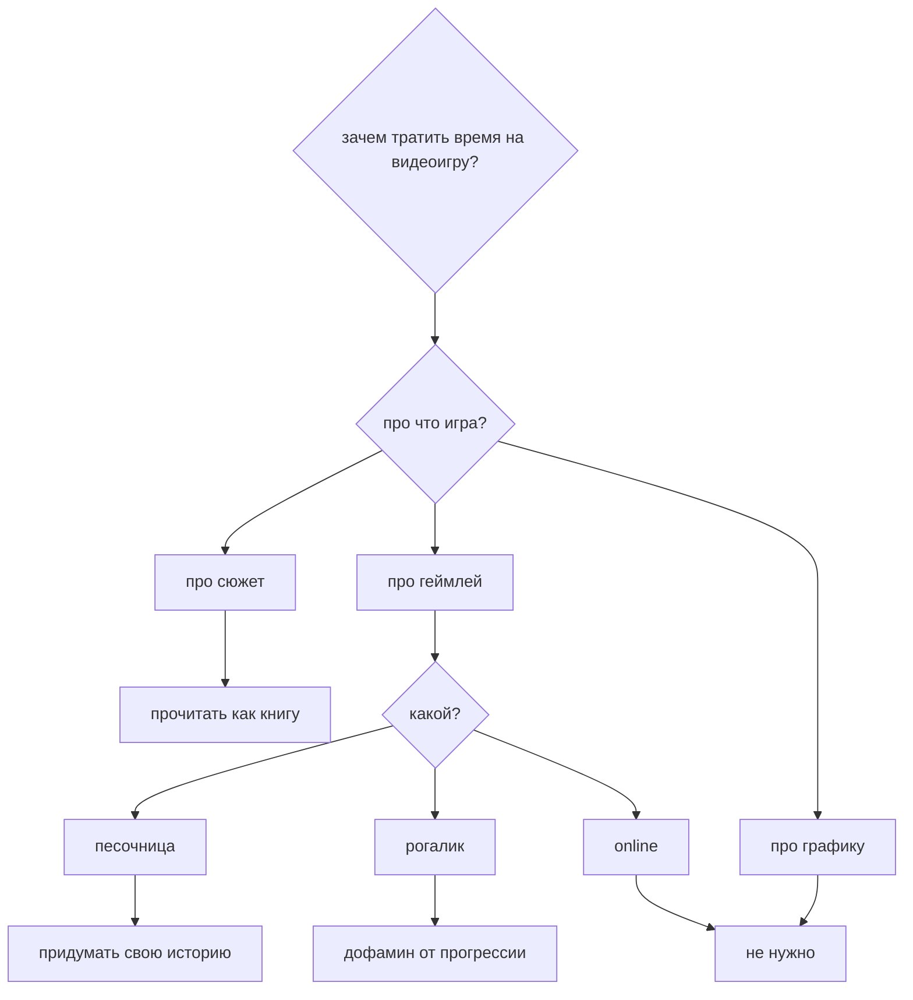

---
{"dg-publish":true,"date":"2024-10-15T16:51:56+03:00","modified_at":"2024-10-15T17:11:23+03:00","dg-path":"/зачем тратить время на видеоигру.md","permalink":"/zachem-tratit-vremya-na-videoigru/","dgPassFrontmatter":true}
---

Почему сел думать за [[Life/Fun/Videogames|Videogames]] после того, как поиграл в Songs of Conquest. И подумал, что в моей голове в первую очередь идёт не жанровая составляющая, а вопрос того сколько времени надо уделить игре. Думаю, что это старпёрство (:

