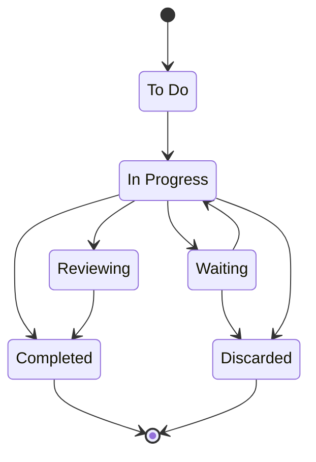

---
{"dg-publish":true,"date":"2022-06-26T21:41:21+03:00","modified_at":"2023-01-22T17:52:31+04:00","permalink":"/metadannye-dlya-zametok-proektov/","dgPassFrontmatter":true}
---


Следуя [[202107201616 Add metadata to notes]], я использую поля в заметках для [[управление проектами]], [[организация личных дел]] и [[стратегирование]].

Иногда бывает так, что какой-то проект был отменён и мы хотим его вернуть. В этом случае не надо возвращать старый проект, а стоит начать с чистого листа. Для связи можно использовать хлебные крошки из [[стандартные метаданные]], а именно поле prev.

### Статусы

1. To do - начальный статус, где надо провести подготовительную работу.
2. In Progress - текущие задачи, проекты, цели.
3. Reviewing - оцениваем результаты перед завершением.
4. Waiting - ожидаем каких-то внешних результатов.
5. Completed - успешно завершили проект.
6. Discarded - безуспешно завершили проект.



### Оценка

Для оценки используется поле `estimate`. Оно содержит в себе предположительную временную рамку, в течении которой будет решаться задача. 
Шкала выглядит следующим образом:
- неделя
- месяц
- полгода
- год
- три года
- 5 лет

В само поле при этом записывается количество дней. Это делается для того, чтобы можно было делать операции по прибавлению и вычитанию. Если писать текстовое поле, то надо будет делать соответствие. При этом количество дней предоставляет гибкость для занесение любого значения. 

### Временные рамки

- `start_date` - дата начала работы. Дата создания лежит в поле `date`, следуя общим метаданным.
- `finish_date` - дата завершения. Неважно, с результатом или без.
- `due_date` - какой-то внешний дедлайн. Может быть получен из оценки с прибавлением поля estimate.

### Итого

Финальные поля выглядят следующим образом:
```
estimate:: 

start_date:: 
due_date:: 
finish_date:: 

status:: 
```
